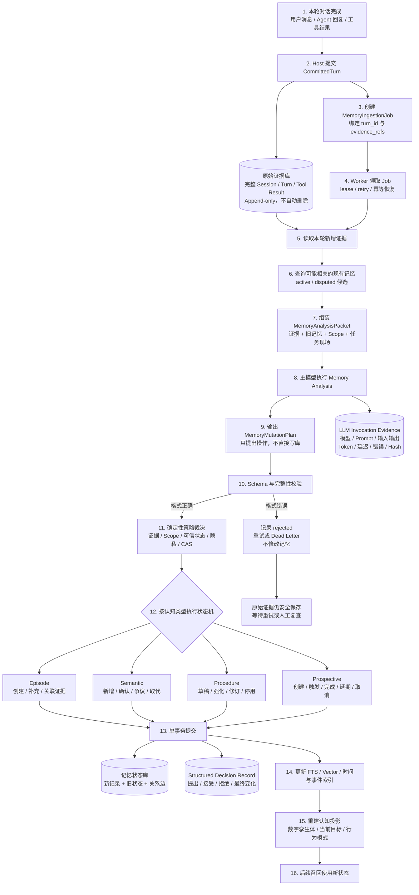

# 记忆写入、演化与审计执行架构

> 日期：2026-08-29
> 状态：`plan-bs` 已确认方向；四类长期记忆与原始数据永久保留规则已确认
> 目标：明确新对话如何形成四类长期记忆，如何处理变化，并保证每一步可审查、可关联、可用于优化

## 1. 端到端执行架构



## 2. 不可破坏的执行顺序

1. Host 先原子保存完整 `CommittedTurn`、原始证据和 turn receipt。
2. 同一提交创建 durable `MemoryIngestionJob`；LLM 失败不得导致 Session 丢失。
3. Worker 通过 lease/attempt/retry 状态机领取任务，重复执行必须幂等。
4. Worker 读取本轮证据，并按主体、Scope、实体和时间查询少量相关现有记忆。
5. SDK 组装 `MemoryAnalysisPacket`，调用主模型提出 `MemoryMutationPlan`。
6. 原始 LLM 调用先写入 `LLMInvocationEvidence`，再解释输出。
7. 确定性代码校验 schema、证据引用、作用域、可信状态、隐私和允许的状态转换。
8. Episode、Semantic、Procedure、Prospective 分别进入自己的状态机。
9. 新记录、旧记录状态、关系边、decision record 和 outbox 在一个事务提交。
10. 索引与数字孪生体投影由 durable outbox 更新；失败可恢复，不能出现已变更状态却缺审计记录。

## 3. LLM 提案与代码裁决

主模型只输出标准提案：

```json
{
  "operations": [
    {
      "operation": "supersede",
      "memory_type": "semantic",
      "target_memory_id": "semantic-12",
      "candidate": {
        "subject": "user",
        "predicate": "lives_in",
        "value": "上海"
      },
      "epistemic_status": "explicit_user_statement",
      "reason_code": "explicit_user_update",
      "evidence_refs": ["message-789"]
    }
  ]
}
```

代码至少验证：

- target 是否存在且属于当前主体和 Scope；
- evidence ref 是否真实、是否在允许的 Session/turn 中；
- 明确事实、外部观察和 LLM 推断是否正确区分；
- 新旧状态是否满足允许的状态转换；
- 版本/CAS 是否仍是模型分析时看到的版本；
- 是否越过隐私、保留或用户明确禁止规则。

LLM 没有数据库写权限，不能自行把记忆标记为 active、合法、可披露或已删除。

## 4. 四类长期记忆状态机方向

### Episode

```text
new → active → amended
             → linked_to_later_episode
             → disputed
```

Episode 引用原始 Session/turn 范围，不复制或替代原始证据。

完整 Session、Turn 和 Tool Result 始终先进入原始证据库；Episode 是从这些证据中选择性建立的
“有长期价值的事件”，不是每轮对话的摘要，也不是传给模型的整段上下文。仅在证据形成下列事件时创建：

- 任务或目标开始、完成、失败或发生实质变化；
- 用户或 Agent 作出会影响后续行为的重要决定；
- 执行动作并产生可观察结果，包括值得复用的成功与需要避免的失败；
- 发生明确纠正、经验教训或用户目标、约束、关系的实质变化；
- 其他对未来任务确有长期解释价值、且能引用原始证据的经历。

寒暄、一次性释义或没有长期价值的普通往返只保留完整原始证据，不强制创建 Episode。未在当时形成 Episode
不等于丢失信息：Worker 可以在新证据出现或用户要求复查时，从仍然存在的原始证据重新处理。

一个 Episode 由一个或多个 `EpisodeSpan` 组成；每个 span 必须是单个 Session 内连续且可校验的 turn 范围。
同一件事跨越多个 Session 时，不合并、改写或移动原始证据，而是分别保留原子 Episode，再通过
`EpisodeThread` / `event_group_id` 建立跨 Session 关系。这样既能召回完整经历链，也能保持证据边界和时间顺序。

LLM 只能提出事件边界、标题、参与者、目标、行动、结果、影响及跨 Session 关联；确定性代码必须验证 span
存在、顺序、主体、Scope、证据蕴含与关系合法性。创建、跳过、补充、拆分、合并提案、跨 Session 关联和争议
均生成 `EpisodeDecision`，记录证据引用、模型/prompt/schema 版本、接受或拒绝结果与稳定 reason code。

### Semantic

Semantic 不使用一个状态字段混合不同概念，而是拆为正交维度：

```text
lifecycle_state:    candidate | active | superseded | rejected | forgotten
epistemic_status:   explicit_user | verified_external | observed_behavior | llm_inference
conflict_status:    uncontested | contested | resolved
verification_state: unverified | user_confirmed | source_verified | repeated_observation
```

用户于 2026-08-30 确认以下转换规则：

- 相同值：不创建重复 Claim，为现有 Claim 增加 supporting evidence；
- 可并存的多值：分别保持 active；
- 用户明确纠正单值：新 Claim active，旧 Claim superseded，保留关系与全部证据；
- 不同时期的值：用 `valid_from/valid_to` 并存，不把历史事实改写成错误；
- 模糊新旧冲突：双方标记 `conflict_status=contested`，不静默选择任何一方；
- LLM 推断不得 supersede 用户明确事实；
- 外部来源冲突按来源策略进入 contested，不静默覆盖；
- 用户明确遗忘时进入 forgotten，并保留防复活 tombstone 与审计记录。

当任务确实依赖 contested 信息时，召回双方及证据并请求用户确认；任务不依赖时不将其投影进工作记忆，
避免无关旧事或隐私信息被主动提起。

### Procedure

```text
draft → active → reinforced
               → revised
               → inapplicable
               → superseded
```

用户于 2026-08-30 确认以下激活和风险规则：

- 用户明确要求“以后都这样做”：证据与 Scope 校验通过后，可直接成为
  `active + explicit_user`；
- 单次成功行为：只能形成 `draft + observed_behavior`，不能推断为长期习惯；
- 多个独立任务中重复采用且成功：进入 `eligible_for_activation`；
- 低风险、可逆操作：达到重复成功证据要求后，可由代码激活为
  `active + observed_behavior`；
- 高风险、外部发布、删除、付款和权限操作：行为观察始终只能形成 draft，必须经用户明确确认才能
  active；
- 用户明确程序始终优先于行为推断程序；新旧程序冲突时保留版本与适用环境，不静默采用新程序；
- 用户纠正、执行失败、工具/环境/版本变化时进入 revised、inapplicable 或 contested，并在再次使用前
  重新校验 applicability。

每次激活、强化、修订、失效和 supersede 都必须关联成功/失败 Episode、用户证据和
`ProcedureDecision` 审计记录。

### Prospective

```text
candidate → pending → triggered → in_progress → completed
              │          │              ├→ rescheduled
              │          │              ├→ cancelled
              │          │              └→ expired
              └──────────┴───────────────→ cancelled
```

前瞻记忆采用“明确行动 + 明确触发”门槛：

- 用户明确表达要完成的行动，同时给出时间、事件、条件或依赖等可判定触发条件时，才创建 `pending`；
- 用户明确表达行动但没有触发条件时，只创建 `candidate`。如果当前任务依赖安排时间，询问用户；否则不主动提醒；
- “以后想学画画”“有机会去日本”一类模糊愿望只进入 Semantic Goal，不创建可触发的 Prospective；
- LLM 从语气、上下文或行为推测出的未来意图最多只能提出 `candidate`，不得直接提醒、调度或执行；
- 时间、事件、任务完成等可靠 runtime signal 由确定性代码判定和驱动状态转换，LLM 只负责提取自然语言意图、
  标准化触发条件和解释含糊状态；
- Memory SDK 保存意图、触发条件、状态和证据，并产生到期/命中候选；Host 负责真正的定时、事件订阅、通知和
  执行。SDK 不在后台越权替用户执行；
- 涉及发布、删除、付款、权限变更或其他高风险外部动作，即使已触发，也必须经过既有权限护栏和必要的用户确认。

`candidate → pending`、触发、延期、取消、完成、过期和执行授权均须关联原始证据与
`ProspectiveDecision`；任何 LLM 提案被接受、降级或拒绝都要留下稳定 reason code。

## 5. 审计账本不是普通 Log

普通 observability 用于健康度、计数和排错，可以保持 privacy-safe 且不包含内容。审计账本是 durable、
append-only 的业务事实源，不能依赖普通日志轮转策略。

每个 LLM 操作必须同时产生：

1. `LLMInvocationEvidence`：模型实际看到什么、公开输出什么、使用了哪个版本、耗时和成本如何。
2. `StructuredDecisionRecord`：代码如何解释输出、哪些提案被接受或拒绝、最终状态怎样变化。

覆盖的操作包括：

- Recall need / route planning；
- Episode segmentation；
- Semantic extraction 与更新；
- Procedure induction/revision；
- Prospective intent extraction；
- Consolidation；
- Conflict resolution；
- Privacy/relevance 判断（若使用 LLM）；
- Digital twin / working-memory projection（若使用 LLM）。

## 6. 每条审计记录的最小字段

```text
identity
├── invocation_id / decision_id
├── session_id / turn_id / run_id / correlation_id
└── principal / scope / operation_type

lineage
├── provider / model / model parameters
├── prompt_template_version / output_schema_version
├── host_version / harness_version / memory_sdk_version
└── policy_version / validator_version

evidence
├── input_evidence_refs / canonical_input_hash
├── protected_raw_input_ref
├── public_model_output / tool calls / canonical_output_hash
└── credential_scan_result

decision
├── proposed operations
├── accepted / rejected operations and stable reason codes
├── before_state_refs / after_state_refs
└── transaction receipt / projection hash

operations
├── started_at / completed_at / latency
├── token usage / available cost
├── finish reason / provider request id
└── error / retry / fallback / dead-letter state
```

禁止保存或索取隐藏思维链。API key、access token、cookie、密码和其他认证材料不得进入审计证据。

## 7. 可审查与优化出口

SDK/Host 必须提供按 `turn_id`、`invocation_id`、`memory_id` 和 `decision_id` 导出完整链路的只读能力，
例如：

```text
export_audit_trace(turn_id)
→ 原始 Session evidence refs
→ LLM invocation evidence
→ proposed mutation/recall plan
→ validation and filter decisions
→ applied/rejected state transitions
→ recall/projected result
```

为了后续优化，审计数据还必须支持聚合但不泄漏内容的指标：

- 各 memory type 的提出、接受、拒绝和无候选比例；
- `no_recall`、漏召回纠正和多余召回反馈；
- 冲突、supersede、disputed 和人工确认比例；
- 非法 schema、重试、超时和 dead-letter；
- 各模型/prompt/schema 版本的延迟、token、费用和结果差异；
- 候选数、过滤 reason code、最终进入工作记忆的数量和字节。

所有聚合必须能下钻到受权限保护的原始审计链；任何模型或 prompt 优化都要保留 old/new lineage，不能
覆盖历史结果来制造“优化后一直正确”的假象。

## 8. 保留与失败原则

- Session、Turn、Tool Result、LLM invocation evidence 和 decision record 等原始数据永久保存，任何系统
  retention job、容量清理或用户请求都不得物理删除或覆盖。
- 用户显式要求“删除/忘记”时执行逻辑遗忘：相关派生记忆进入 `forgotten`/不可访问状态，退出普通召回、
  工作记忆投影、数字孪生体与索引结果；原始证据和完整状态变化仍留在权限隔离的审计域。
- 被逻辑遗忘的内容不得因重跑 Worker、重新巩固或索引重建自动复活；确定性 tombstone/deny rule 必须先于
  LLM 提取和召回生效。只有用户后续明确撤销遗忘，才允许通过新的审计决策恢复可访问状态。
- LLM 超时、拒答、非法输出或重试耗尽只影响派生记忆，不能删除原始证据。
- 状态事务失败必须保留 rejected/failure decision，且不能留下半个 supersede 或缺失关系边。
- 同一 job replay 必须返回同一结果或显式 conflict，不能重复生成派生记忆。
